```mermaid
graph TB
    %% Actores
    Cliente([👨‍💼 Cliente])
    Recepcionista([👩‍💻 Recepcionista])
    Veterinario([👨‍⚕️ Veterinario])
    Admin([👨‍💼 Administrador])
    SisNotif([⏰ Sistema Notificaciones])
    
    %% Casos de Uso Principales
    subgraph "Sistema de Gestión de Citas"
        UC1[📅 Solicitar Cita]
        UC2[📝 Registrar Cita]
        UC3[🔍 Consultar Disponibilidad]
        UC4[✅ Confirmar Cita]
        UC5[⏰ Reprogramar Cita]
        UC6[❌ Cancelar Cita]
        UC7[📊 Gestionar Estado Cita]
        UC8[📋 Realizar Consulta]
        UC9[💰 Calcular Precio]
        UC10[📧 Enviar Recordatorios]
        UC11[📈 Generar Reportes Citas]
    end
    
    %% Casos de Uso de Apoyo
    subgraph "Funciones de Soporte"
        UC12[🔐 Validar Permisos]
        UC13[📊 Verificar Horarios]
        UC14[💾 Registrar Historial]
        UC15[📱 Notificar Estados]
    end
    
    %% Conexiones
    Cliente --> UC1
    Cliente --> UC4
    Cliente --> UC5
    Cliente --> UC6
    
    Recepcionista --> UC2
    Recepcionista --> UC3
    Recepcionista --> UC4
    Recepcionista --> UC5
    Recepcionista --> UC6
    Recepcionista --> UC7
    
    Veterinario --> UC7
    Veterinario --> UC8
    Veterinario --> UC9
    
    Admin --> UC11
    Admin --> UC12
    
    SisNotif --> UC10
    SisNotif --> UC15
    
    %% Relaciones Include/Extend
    UC1 -.->|include| UC3
    UC2 -.->|include| UC12
    UC2 -.->|include| UC13
    UC4 -.->|extend| UC10
    UC5 -.->|extend| UC10
    UC8 -.->|include| UC14
```

```mermaid
graph TB
    %% Actores
    Veterinario([👨‍⚕️ Veterinario])
    Recepcionista([👩‍💻 Recepcionista])
    Admin([👨‍💼 Administrador])
    Cliente([👨‍💼 Cliente])
    SisAudit([📊 Sistema Auditoría])
    
    %% Casos de Uso Principales
    subgraph "Gestión de Historiales Médicos"
        UC1[📝 Crear Historial]
        UC2[🔄 Actualizar Historial]
        UC3[🔍 Consultar Historial]
        UC4[📋 Registrar Tratamiento]
        UC5[💉 Registrar Vacunas]
        UC6[🏥 Registrar Procedimiento]
        UC7[💊 Prescribir Medicamentos]
        UC8[📊 Generar Reporte Médico]
        UC9[📱 Compartir Historial]
        UC10[🔒 Archivar Historial]
    end
    
    %% Casos de Uso de Control
    subgraph "Control y Seguridad"
        UC11[🔐 Validar Permisos Acceso]
        UC12[📝 Registrar Cambios]
        UC13[✅ Validar Integridad]
        UC14[📊 Auditar Accesos]
        UC15[🔄 Sincronizar Datos]
    end
    
    %% Conexiones
    Veterinario --> UC1
    Veterinario --> UC2
    Veterinario --> UC3
    Veterinario --> UC4
    Veterinario --> UC5
    Veterinario --> UC6
    Veterinario --> UC7
    
    Recepcionista --> UC3
    Recepcionista --> UC8
    
    Admin --> UC8
    Admin --> UC9
    Admin --> UC10
    Admin --> UC14
    
    Cliente --> UC3
    
    SisAudit --> UC12
    SisAudit --> UC14
    
    %% Relaciones Include/Extend
    UC1 -.->|include| UC11
    UC2 -.->|include| UC11
    UC3 -.->|include| UC11
    UC2 -.->|include| UC12
    UC4 -.->|include| UC13
    UC5 -.->|include| UC13
    UC6 -.->|include| UC13
    UC8 -.->|extend| UC9
```

```mermaid
graph TB
    %% Actores
    SuperAdmin([👨‍💼 Super Admin])
    Admin([👨‍💼 Administrador])
    RRHH([👥 Gestor RRHH])
    Veterinario([👨‍⚕️ Veterinario])
    Recepcionista([👩‍💻 Recepcionista])
    SisSeg([🔒 Sistema Seguridad])
    
    %% Casos de Uso Principales
    subgraph "Gestión de Roles y Permisos"
        UC1[👤 Crear Usuario]
        UC2[🔧 Modificar Usuario]
        UC3[🗑️ Eliminar Usuario]
        UC4[🎭 Asignar Rol]
        UC5[🔐 Configurar Permisos]
        UC6[👥 Gestionar Grupos]
        UC7[🔍 Auditar Accesos]
        UC8[🔄 Cambiar Estado Usuario]
        UC9[🔑 Resetear Credenciales]
        UC10[📊 Generar Reporte Usuarios]
    end
    
    %% Casos de Uso de Seguridad
    subgraph "Seguridad y Control"
        UC11[🔐 Validar Autenticación]
        UC12[✅ Verificar Autorización]
        UC13[📝 Registrar Actividad]
        UC14[⚠️ Detectar Actividad Sospechosa]
        UC15[🔒 Bloquear Acceso]
        UC16[📊 Monitorear Sesiones]
    end
    
    %% Conexiones
    SuperAdmin --> UC1
    SuperAdmin --> UC2
    SuperAdmin --> UC3
    SuperAdmin --> UC4
    SuperAdmin --> UC5
    SuperAdmin --> UC6
    SuperAdmin --> UC7
    SuperAdmin --> UC10
    
    Admin --> UC1
    Admin --> UC2
    Admin --> UC4
    Admin --> UC8
    Admin --> UC9
    Admin --> UC10
    
    RRHH --> UC1
    RRHH --> UC2
    RRHH --> UC8
    
    Veterinario --> UC11
    Recepcionista --> UC11
    
    SisSeg --> UC11
    SisSeg --> UC12
    SisSeg --> UC13
    SisSeg --> UC14
    SisSeg --> UC15
    SisSeg --> UC16
    
    %% Relaciones Include/Extend
    UC1 -.->|include| UC4
    UC2 -.->|include| UC12
    UC4 -.->|include| UC5
    UC8 -.->|extend| UC15
    UC11 -.->|include| UC13
    UC12 -.->|include| UC13
    UC14 -.->|extend| UC15
```

```mermaid
graph TB
    %% Actores
    Admin([👨‍💼 Administrador])
    EncInv([📦 Enc. Inventario])
    Recepcionista([👩‍💻 Recepcionista])
    Veterinario([👨‍⚕️ Veterinario])
    Proveedor([🚚 Proveedor])
    SisFact([💰 Sistema Facturación])
    
    %% Casos de Uso Principales
    subgraph "Gestión de Inventario"
        UC1[📦 Registrar Producto]
        UC2[📊 Controlar Stock]
        UC3[🔄 Actualizar Inventario]
        UC4[⚠️ Gestionar Alertas Stock]
        UC5[🛒 Procesar Compra]
        UC6[💳 Registrar Venta]
        UC7[📋 Generar Orden Compra]
        UC8[📊 Calcular Costos]
    end
    
    %% Casos de Uso Financieros
    subgraph "Gestión Financiera"
        UC9[💰 Procesar Pago]
        UC10[🧾 Generar Factura]
        UC11[📊 Calcular Impuestos]
        UC12[💹 Analizar Rentabilidad]
        UC13[📈 Generar Reportes Ventas]
        UC14[💵 Gestionar Descuentos]
    end
    
    %% Casos de Uso de Control
    subgraph "Control y Auditoría"
        UC15[🔍 Auditar Movimientos]
        UC16[📊 Reconciliar Inventario]
        UC17[⚠️ Detectar Discrepancias]
        UC18[📝 Registrar Pérdidas]
        UC19[🔄 Sincronizar Sistemas]
    end
    
    %% Conexiones
    Admin --> UC1
    Admin --> UC3
    Admin --> UC7
    Admin --> UC12
    Admin --> UC13
    Admin --> UC15
    Admin --> UC16
    
    EncInv --> UC1
    EncInv --> UC2
    EncInv --> UC3
    EncInv --> UC4
    EncInv --> UC5
    EncInv --> UC7
    EncInv --> UC16
    EncInv --> UC17
    EncInv --> UC18
    
    Recepcionista --> UC6
    Recepcionista --> UC9
    Recepcionista --> UC10
    Recepcionista --> UC14
    
    Veterinario --> UC2
    
    Proveedor --> UC5
    
    SisFact --> UC9
    SisFact --> UC10
    SisFact --> UC11
    SisFact --> UC19
    
    %% Relaciones Include/Extend
    UC6 -.->|include| UC8
    UC6 -.->|include| UC9
    UC9 -.->|include| UC10
    UC10 -.->|include| UC11
    UC5 -.->|include| UC3
    UC6 -.->|include| UC3
    UC2 -.->|extend| UC4
    UC16 -.->|extend| UC17
    UC17 -.->|extend| UC18
```

# 🐾 **ZOOFIPETS - SISTEMA DE GESTIÓN VETERINARIA**

## 📋 **GUÍAS COMPLETAS DE DIAGRAMAS DE CASOS DE USO**

Este repositorio contiene la documentación técnica completa de los 4 funcionamientos internos más complejos del Sistema de Gestión Veterinaria ZoofiPets, implementados mediante diagramas de casos de uso UML y especificaciones detalladas.

---

## 🎯 **PROCESOS COMPLEJOS DOCUMENTADOS**

1. **🗓️ Sistema de Gestión de Citas Médicas** - Proceso más complejo con múltiples estados y validaciones
2. **📊 Sistema de Gestión de Historiales Médicos** - Control de información crítica con trazabilidad
3. **👥 Sistema de Gestión de Roles y Permisos** - Control de accesos multinivel
4. **💰 Sistema de Gestión de Inventario y Ventas** - Proceso financiero con múltiples validaciones

---

## 🗓️ **GUÍA 1: SISTEMA DE GESTIÓN DE CITAS MÉDICAS**

### **🎭 ACTORES DEL SISTEMA:**
- **👨‍💼 Cliente** - Propietario de mascotas
- **👩‍💻 Recepcionista** - Personal de recepción
- **👨‍⚕️ Veterinario** - Profesional médico
- **👨‍💼 Administrador** - Gestor del sistema
- **⏰ Sistema de Notificaciones** - Actor secundario automatizado

### **📊 DIAGRAMA DE CASOS DE USO:**



### **📝 ESPECIFICACIONES DETALLADAS:**

#### **📅 UC1: Solicitar Cita**
- **Precondición:** Cliente autenticado con mascota registrada
- **Flujo Principal:**
  1. Cliente accede al sistema de citas
  2. Selecciona mascota para la cita
  3. Elige tipo de servicio médico
  4. Indica síntomas o motivo de consulta
  5. Sistema verifica disponibilidad
  6. Cliente confirma datos de la solicitud
  7. Sistema genera número de cita único
  8. Envía confirmación al cliente

- **Flujos Alternativos:**
  - **A1:** No hay disponibilidad → Sistema sugiere horarios alternativos
  - **A2:** Servicio requiere cita urgente → Sistema prioriza la solicitud

#### **📝 UC8: Realizar Consulta**
- **Precondición:** Cita confirmada, veterinario autenticado
- **Flujo Principal:**
  1. Veterinario inicia consulta
  2. Revisa historial médico previo
  3. Registra síntomas actuales
  4. Realiza examen físico
  5. Establece diagnóstico
  6. Prescribe tratamiento
  7. Actualiza historial médico
  8. Cambia estado de cita a "Completada"
  9. Genera resumen de consulta

### **⚙️ REGLAS DE NEGOCIO:**
- **RN001:** Citas de emergencia tienen prioridad sobre citas regulares
- **RN002:** Una mascota no puede tener más de 3 citas pendientes simultáneamente
- **RN003:** Cancelaciones con menos de 2 horas de anticipación generan penalización
- **RN004:** Estados válidos: Programada → Confirmada → En_Proceso → Completada
- **RN005:** Solo veterinarios pueden cambiar estado a "En_Proceso" y "Completada"

---

## 📊 **GUÍA 2: SISTEMA DE GESTIÓN DE HISTORIALES MÉDICOS**

### **🎭 ACTORES DEL SISTEMA:**
- **👨‍⚕️ Veterinario** - Creador y actualizador de historiales
- **👩‍💻 Recepcionista** - Consultora de historiales básicos
- **👨‍💼 Administrador** - Gestor completo de historiales
- **👨‍💼 Cliente** - Consultor limitado de su mascota
- **📊 Sistema de Auditoría** - Registro de cambios

### **📊 DIAGRAMA DE CASOS DE USO:**



### **📝 ESPECIFICACIONES DETALLADAS:**

#### **📝 UC1: Crear Historial**
- **Precondición:** Mascota registrada, veterinario autenticado
- **Flujo Principal:**
  1. Veterinario selecciona mascota
  2. Accede a formulario de nuevo historial
  3. Registra datos básicos (peso, temperatura, frecuencia cardíaca)
  4. Documenta motivo de consulta
  5. Registra examen físico realizado
  6. Establece diagnóstico preliminar
  7. Sistema valida integridad de datos
  8. Asigna número único de historial
  9. Registra timestamp y veterinario responsable

#### **📊 UC8: Generar Reporte Médico**
- **Precondición:** Historial completo disponible
- **Flujo Principal:**
  1. Usuario autorizado solicita reporte
  2. Selecciona tipo de reporte (completo, resumen, período específico)
  3. Sistema compila información médica
  4. Genera documento con formato estándar
  5. Incluye gráficos de evolución si aplica
  6. Añade firma digital del veterinario
  7. Opción de exportar en PDF o imprimir

### **⚙️ REGLAS DE NEGOCIO:**
- **RN001:** Historiales médicos son inmutables una vez firmados digitalmente
- **RN002:** Solo veterinarios pueden crear y modificar historiales
- **RN003:** Todos los cambios deben ser auditados con timestamp y responsable
- **RN004:** Clientes solo pueden ver historiales de sus propias mascotas
- **RN005:** Historiales archivados requieren autorización especial para acceso

---

## 👥 **GUÍA 3: SISTEMA DE GESTIÓN DE ROLES Y PERMISOS**

### **🎭 ACTORES DEL SISTEMA:**
- **👨‍💼 Super Administrador** - Control total del sistema
- **👨‍💼 Administrador** - Gestión de usuarios y roles
- **👥 Gestor de RRHH** - Gestión de empleados
- **👨‍⚕️ Veterinario** - Usuario con permisos médicos
- **👩‍💻 Recepcionista** - Usuario con permisos administrativos
- **🔒 Sistema de Seguridad** - Validador de permisos

### **📊 DIAGRAMA DE CASOS DE USO:**



### **📝 ESPECIFICACIONES DETALLADAS:**

#### **👤 UC1: Crear Usuario**
- **Precondición:** Administrador autenticado con permisos de gestión
- **Flujo Principal:**
  1. Administrador accede a gestión de usuarios
  2. Completa formulario de nuevo usuario (datos personales, laborales)
  3. Asigna rol base según cargo
  4. Configura permisos específicos
  5. Genera credenciales temporales
  6. Sistema valida unicidad de datos
  7. Envía credenciales por email seguro
  8. Registra creación en log de auditoría

#### **🔐 UC12: Verificar Autorización**
- **Precondición:** Usuario autenticado en sesión activa
- **Flujo Principal:**
  1. Usuario intenta acceder a función específica
  2. Sistema captura solicitud de acceso
  3. Verifica rol asignado al usuario
  4. Consulta permisos específicos para la función
  5. Evalúa restricciones temporales o contextuales
  6. Autoriza o deniega acceso
  7. Registra resultado en log de seguridad

### **⚙️ REGLAS DE NEGOCIO:**
- **RN001:** Un usuario puede tener múltiples roles pero con jerarquía definida
- **RN002:** Permisos específicos prevalecen sobre permisos de rol general
- **RN003:** Super Administrador no puede ser eliminado del sistema
- **RN004:** Cambios de permisos requieren autorización de nivel superior
- **RN005:** Usuarios inactivos por 90 días son suspendidos automáticamente

---

## 💰 **GUÍA 4: SISTEMA DE GESTIÓN DE INVENTARIO Y VENTAS**

### **🎭 ACTORES DEL SISTEMA:**
- **👨‍💼 Administrador** - Gestión completa del inventario
- **📦 Encargado de Inventario** - Control de stock y productos
- **👩‍💻 Recepcionista** - Ventas y consultas básicas
- **👨‍⚕️ Veterinario** - Consulta medicamentos y suministros
- **🚚 Proveedor** - Actor externo de suministros
- **💰 Sistema de Facturación** - Procesamiento automático

### **📊 DIAGRAMA DE CASOS DE USO:**



### **📝 ESPECIFICACIONES DETALLADAS:**

#### **📦 UC1: Registrar Producto**
- **Precondición:** Usuario autorizado con permisos de inventario
- **Flujo Principal:**
  1. Usuario accede a formulario de registro
  2. Ingresa datos básicos (nombre, descripción, categoría)
  3. Configura información de stock (mínimo, máximo, unidad)
  4. Establece precios (costo, venta, mayoreo)
  5. Asigna proveedor y códigos de identificación
  6. Define parámetros de caducidad si aplica
  7. Sistema valida unicidad de códigos
  8. Genera código interno único
  9. Activa producto para uso en sistema

#### **💳 UC6: Registrar Venta**
- **Precondición:** Productos disponibles en stock, cliente identificado
- **Flujo Principal:**
  1. Recepcionista inicia nueva venta
  2. Agrega productos al carrito de compra
  3. Sistema verifica disponibilidad de stock
  4. Calcula subtotales y totales automáticamente
  5. Aplica descuentos si corresponde
  6. Cliente selecciona método de pago
  7. Sistema procesa el pago
  8. Actualiza stock automáticamente
  9. Genera factura legal
  10. Entrega comprobante al cliente

### **⚙️ REGLAS DE NEGOCIO:**
- **RN001:** Stock no puede ser negativo para productos controlados
- **RN002:** Productos vencidos deben ser marcados automáticamente como no vendibles
- **RN003:** Ventas superiores a $500 requieren autorización de supervisor
- **RN004:** Alertas de stock mínimo se envían automáticamente a encargados
- **RN005:** Movimientos de inventario requieren justificación documentada

---

##  **CONSIDERACIONES TÉCNICAS Y MEJORES PRÁCTICAS**

### **🔧 PATRONES DE IMPLEMENTACIÓN:**

#### **1. Patrón de Responsabilidad por Capas:**
- **Controladores:** Gestión de lógica de presentación
- **Servicios:** Lógica de negocio compleja
- **Repositorios:** Acceso a datos con abstracción
- **Middleware:** Validación de permisos transversal

#### **2. Patrón Estado para Citas:**
```php
// Estados válidos y transiciones permitidas
enum EstadoCita {
    Programada -> [Confirmada, Cancelada]
    Confirmada -> [En_Proceso, No_Asistio, Cancelada]
    En_Proceso -> [Completada]
    Completada -> [Finalizada]
}
```

#### **3. Patrón Observer para Notificaciones:**
```php
// Eventos automáticos del sistema
CitaCreada -> EnviarRecordatorio (24h antes)
CitaModificada -> NotificarCambios
StockBajo -> AlertarEncargado
HistorialModificado -> RegistrarAuditoria
```

### **� OPTIMIZACIONES RECOMENDADAS:**

#### **1. Cache de Consultas Frecuentes:**
- Disponibilidad de horarios veterinarios
- Listado de servicios activos
- Información básica de mascotas
- Permisos de usuario por rol

#### **2. Índices de Base de Datos:**
```sql
-- Índices críticos para rendimiento
INDEX idx_citas_fecha_veterinario (fecha_hora, empleado_id)
INDEX idx_historiales_mascota_fecha (mascota_id, created_at)
INDEX idx_usuarios_rol_activo (role_id, activo)
INDEX idx_productos_stock_categoria (stock_actual, categoria_id)
```

#### **3. Validaciones Asíncronas:**
- Verificación de stock en tiempo real
- Validación de horarios disponibles
- Comprobación de permisos complejos

### **📱 INTEGRACIÓN CON SISTEMAS EXTERNOS:**

#### **1. APIs de Terceros:**
- **Sistema de Pagos:** PayPal, Stripe para transacciones
- **Notificaciones:** Twilio para SMS, SendGrid para emails
- **Facturación:** SRI para facturas electrónicas

#### **2. Sincronización de Datos:**
- **Backup automático:** Cada 6 horas
- **Replicación:** Base de datos secundaria para reportes
- **Logs centralizados:** ELK Stack para auditorías

### **🔐 SEGURIDAD IMPLEMENTADA:**

#### **1. Autenticación Multinivel:**
```php
// Middleware de seguridad por capas
Route::middleware(['auth', 'role:veterinario', 'permission:historiales.write'])
    ->group(function () {
        Route::post('/historiales', [HistorialController::class, 'store']);
    });
```

#### **2. Encriptación de Datos Sensibles:**
- Historiales médicos: AES-256
- Información personal: Hash irreversible
- Contraseñas: bcrypt con salt

#### **3. Auditoría Completa:**
- Registro de todos los accesos
- Tracking de modificaciones de datos
- Alertas de actividad sospechosa

---

## 🛠️ **TECNOLOGÍAS UTILIZADAS**

- **Backend:** Laravel 11.x (PHP 8.2+)
- **Base de Datos:** MySQL 8.0
- **Frontend:** Blade Templates + Vite
- **Autenticación:** Laravel Sanctum
- **Cache:** Redis
- **Cola de Trabajos:** Laravel Queue
- **Testing:** PHPUnit

---

## 📦 **INSTALACIÓN Y CONFIGURACIÓN**

### **Requisitos Previos:**
- PHP 8.2 o superior
- Composer
- Node.js 18+
- MySQL 8.0
- Redis (opcional para cache)

### **Pasos de Instalación:**

1. **Clonar el repositorio:**
```bash
git clone https://github.com/tu-usuario/zoofipets.git
cd zoofipets
```

2. **Instalar dependencias:**
```bash
composer install
npm install
```

3. **Configurar variables de entorno:**
```bash
cp .env.example .env
php artisan key:generate
```

4. **Configurar base de datos:**
```bash
php artisan migrate
php artisan db:seed
```

5. **Compilar assets:**
```bash
npm run build
```

6. **Iniciar servidor:**
```bash
php artisan serve
```

---

## 📄 **LICENCIA**

Este proyecto está licenciado bajo la Licencia MIT - ver el archivo [LICENSE](LICENSE) para detalles.

---

## 👥 **CONTRIBUCIONES**

Las contribuciones son bienvenidas. Por favor, lee las [guías de contribución](CONTRIBUTING.md) antes de enviar un pull request.

---

## 📞 **CONTACTO**

- **Email:** soporte@zoofipets.com
- **Documentación:** [docs.zoofipets.com](https://docs.zoofipets.com)
- **Issues:** [GitHub Issues](https://github.com/tu-usuario/zoofipets/issues)

---

## 📋 **RESUMEN EJECUTIVO**

### **✅ DOCUMENTACIÓN COMPLETADA:**

**🎯 OBJETIVO LOGRADO:** Se han documentado 4 guías completas de diagramas de casos de uso para los funcionamientos internos más complejos del sistema ZoofiPets.

### **📊 ENTREGABLES:**

1. **🗓️ Gestión de Citas Médicas** - 15 casos de uso con estados complejos
2. **📊 Gestión de Historiales Médicos** - 15 casos de uso con auditoría completa  
3. **👥 Gestión de Roles y Permisos** - 16 casos de uso de seguridad multinivel
4. **💰 Gestión de Inventario y Ventas** - 19 casos de uso financieros integrados

### **🔧 COMPONENTES INCLUIDOS:**
- ✅ Diagramas UML completos con notación estándar
- ✅ Especificaciones detalladas por caso de uso
- ✅ Reglas de negocio específicas por módulo
- ✅ Consideraciones técnicas de implementación
- ✅ Patrones de diseño recomendados
- ✅ Optimizaciones de rendimiento
- ✅ Medidas de seguridad integradas

### **💡 VALOR AGREGADO:**
- **Trazabilidad completa** de procesos críticos
- **Validaciones robustas** en múltiples capas
- **Escalabilidad** para crecimiento futuro
- **Seguridad** de nivel empresarial
- **Integración** con sistemas externos

Esta documentación proporciona la base técnica completa para implementar, mantener y escalar los procesos más complejos del sistema veterinario ZoofiPets de manera profesional y eficiente.